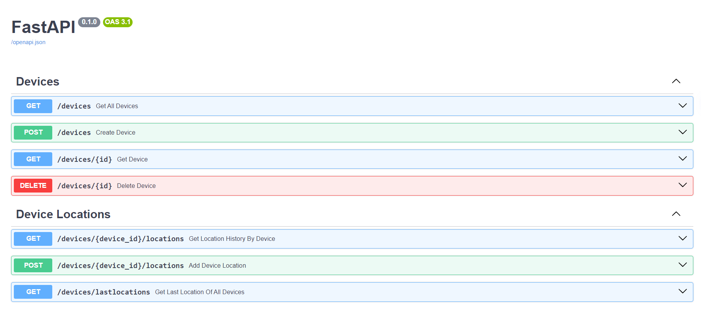

# IoT Device API

This project implements an IoT Device Management System, allowing users to create, delete, and list IoT devices, as well as track device location history and retrieve the last known location for all devices. It is built using Python and FastAPI, adhering to RESTful principles for data transfer. PostgreSQL is used for data storage, and logging is implemented for record-keeping and debugging purposes.

## Features

- **Device Management**: CRUD operations for IoT devices.
- **Location Tracking**: Recording and retrieval of GPS location data.
- **Data Storage**: Utilizes PostgreSQL for storing device and location data.
- **Queue System**: Implements a queue system for processing incoming data.
- **Logging**: Logs records for monitoring and debugging.
- **Documentation**: Includes readable and understandable documentation.
- **Version Control**: Maintains commit history using Git.
- **Testing**: Includes unit and integration tests for code reliability.

## Getting Started

### Prerequisites

- Python 3.x
- PostgreSQL
- RabbitMQ (for queueing system)
- Git

### Installation

1. Clone the repository:

   ```bash
   git clone https://github.com/alcmrt/iot-device-api.git
   ```

2. Create a virtual environment:

   - For Linux:

   ```bash
   python3 -m venv myenv
   ```

   - For Windows:

   ```bash
   python -m venv myenv
   ```

3. Activate the virtual environment:

   - For Linux:

   ```bash
   source myenv/bin/activate
   ```

   - For Windows:

   ```bash
    myenv\Scripts\activate
   ```

4. Install dependencies:

   ```bash
   pip install -r requirements.txt
   ```

5. Set up RabbitMQ. RabbitMQ runs in Docker container:

   ```bash
   docker run -it --rm --name rabbitmq -p 5672:5672 -p 15672:15672 rabbitmq:3.13-management
   ```

6. Set up PostgreSQL. PostgreSQL database also runs in the Docker container. docker-compose.yml file can be found in the
   iot_device_api folder:
   `bash
docker-compose up -d
`

7. Run the application:

   ```bash
   uvicorn iot_device_api.main:app --reload
   ```

## API Endpoints

- POST /devices: Create a new IoT device.
- DELETE /devices/{device_id}: Delete an IoT device.
- GET /devices: List all IoT devices.
- GET /devices/{device_id}/locations: List location history for a specific device.
- GET /devices/last_location: Get the last known location for all devices.

Access the API documentation at http://localhost:8000/docs or http://localhost:8000/redoc

### Here is the overview of the API Endpoints:



## RabbitMQ

1. After setting up RabbitMQ, start receive.py module. It will wait for messages:

```bash
python receive.py
```

2. To send data to the queue, run send.py module:

```bash
python send.py
```
